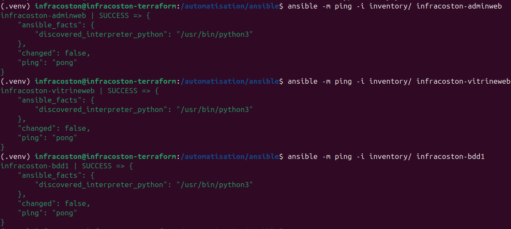
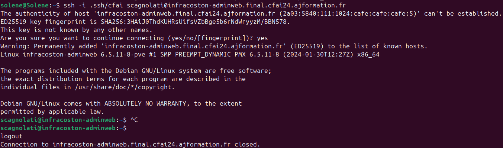
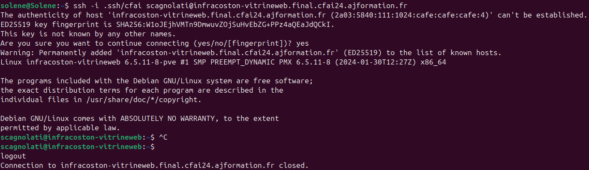
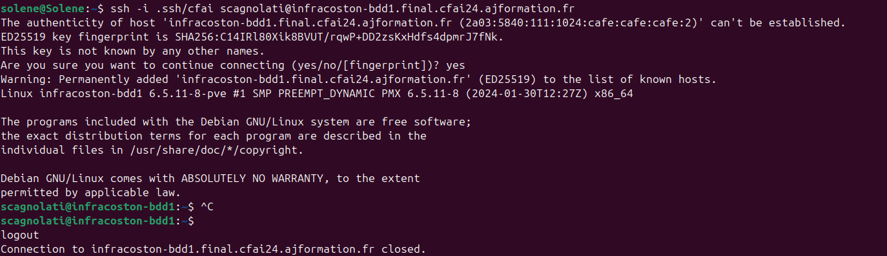
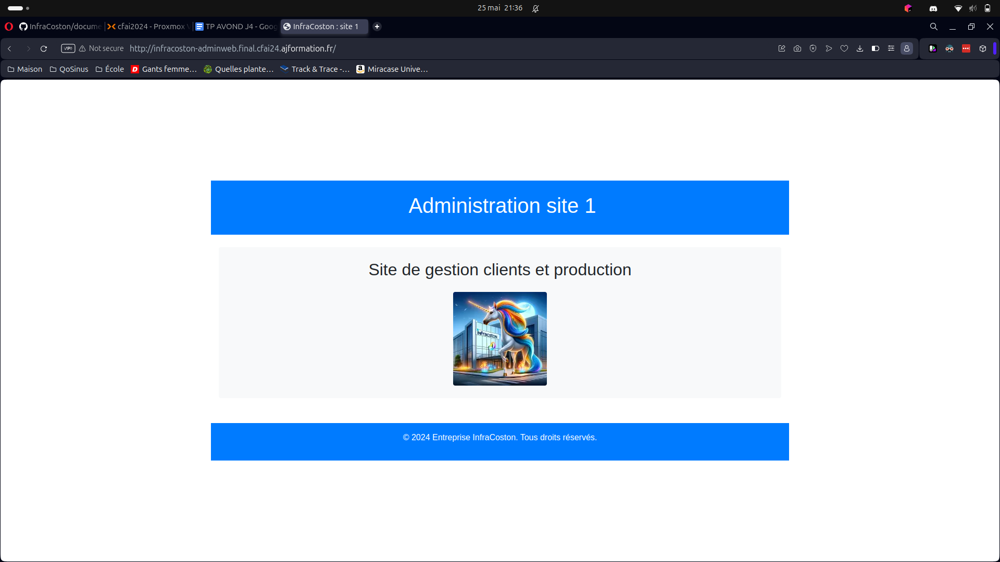
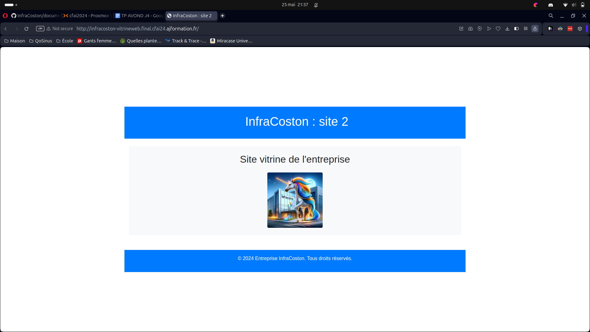
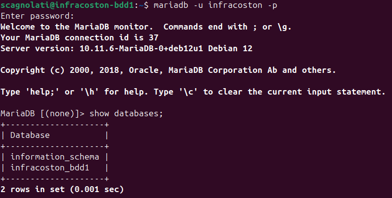

# Auteurs
* Solène CAGNOLATI
* Thomas COLLADO
* Lenny COSTON
* Florence EXTRAT
* Estelle GRANGE
* Amélie PIRAUD

# Objectifs de l'exercice

L'objectif du TP est de créer un container LXC sur lequel seront installés les outils Terraform et Ansible.
L'outil Terraform génèrera 3 containers :
* Une base de données
* Un site web gestion de clients
* Un site web vitrine de l'entreprise

Les deux sites web contiennent une page HTML et CSS.
Une fois les conteneurs créés, le projet doit lancer un ou plusieurs playbooks Ansible qui devront :
* Créer et configurer les utilisateurs de l'équipe
* Installer et configurer les outils nécessaires
* Déposer les fichiers HTML et CSS nécessaires pour chasue site.

# Journal d'activité

## Création du container Terraform
- Configuration physique de la machine

## Configuration du container Terraform
- Congifuration d'une adresse IPv6 fixe
- Création et configuration des utilisateurs

### Création et configuration des utilisateurs
- Installation de **sudo**
- Création des utilisateurs suivants :
    * scagnolati
    * tcollado
    * lcoston
    * fextrat
    * egrange
    * apiraud
    * javond
    * infracoston (utilisateur qui permet de se connecter de Terraform aux containers Ansible)
- Ajouter les utilisateurs au groupe **sudo**
- Pour chaque utilisateur **sauf infracoston**:
    - Créer son **/home**
    - Créer le fichier **.ssh/authorized_keys** et renseigner la clé SSH de l'utilisateur

### Configuration IP
* Configuration d'une adresse IPv6 fixe pour le container terraform.
```bash
> cat /etc/network/interfaces
auto lo
iface lo inet loopback
auto eth0
iface eth0 inet dhcp
iface eth0 inet6 static
    address 2a03:5840:111:1024:cafe:cafe:cafe:0001
    netmask 64
```
* Les autres IP sont générées par terraform

### Configuration SSH
* :warning: Aucune connexion ne se fait par mot de passe.
* Créer une clé SSH pour le container Terraform :
```bash
# Dans le dossier .ssh
# Remplacer <name> par le nom de la clé
ssh keygen -f <name>
```

#### Sécurité
- Mise en place d'un useragent pour permettre la connexion SSH sans mot de passe.
```bash
# On place le ssh-agent dans le .bashrc de notre utilisateur
nano /home/infracoston/.bashrc
eval "$(ssh-agent -s)"
ssh-add /automatisation/ansible/ssh/infracoston
```

## Configuration des DNS
* Travaux effectués :
    - Positionnement des DNS via l'outil [ns1.cfai2024](http://ns1.cfai2024.ajformation.fr:5000/)
    - Vérification des avec la commande :
```bash
host infracoston-terraform.final.cfai24.ajformation.fr.
```

## Installation et configuration de Terraform
* Créer un dossier **/automatisation** à la racine du container terraform
* Créer un dossier **/automatisation/terraform**
* Zipper les fichiers de l'ancien container terraform
* Copier les fichiers en scp dans le dossier /automatisation/terraform
* Dézipper le folder dans le dossier /automatisation/terraform
* Créer l'environnement 
```bash
# Dans le dossier /automatisation/terraform
python3 -m venv .venv/
```
* Exécuter l'environnement 
```bash
. ./.venv/bin/activate
```
* Créer le fichier [install.sh](./automatisation/terraform/install.sh)
* Modifier le fichier [container.tf](./automatisation/terraform/container.tf)
* Modifier le fichier [variables.tf](./automatisation/terraform/variables.tf)
* Modifier le fichier [nodes.yaml](./automatisation/terraform/nodes.yaml)
* Modifier le fichier [nodes.auto.tfvars.json](./automatisation/terraform/nodes.auto.tfvars.json)
* Appliquer l'environnement :
```bash
Commande : source passwords.env
```
* Vérifier la validité des configurations :
```bash
./terraform validate
```
* Vérifier les modifications à appliquer :
```bash
./terraform plan
```
* Appliquer les modifications :
```bash
./terraform apply -target 'proxmox_lxc.infracoston["infracoston-adminweb"]' -auto-approve
./terraform apply -target 'proxmox_lxc.infracoston["infracoston-vitrineweb"]' -auto-approve
./terraform apply -target 'proxmox_lxc.infracoston["infracoston-bdd1"]' -auto-approve
```

## Installation et configuration d'Ansible
* Création d'un environnement python
```bash
python3 -m venv .venv
. ./.venv/bin/activate
```
* Installation d'ansible
```bash
pip3 installe ansible
```
* Créer le fichier de configuration
```bash
ansible-config init --disabled > ansible.cfg
```

* Créer son inventaire
```bash
# Définir les groupes et les hôtes
mkdir inventory
mkdir inventory/host_vars
mkdir inventory/group_vars
```

* Fichier de configuration de l'[inventaire]((./../automatisation/ansible/inventory/inventory.yaml))
```bash
nano inventory/inventory.yaml
```

* Fichier de configuration des [hosts](./../automatisation/ansible/inventory/host_vars/)
```bash
nano inventory/host_vars/infracoston-adminweb.yaml
nano inventory/host_vars/infracoston-vitrineweb.yaml
nano inventory/host_vars/infracoston-bdd1.yaml
```

* Fichier de configuration des [groups](./../automatisation/ansible/inventory/group_vars/)
```bash
nano inventory/group_vars/infracoston.yaml
```

* Lister son inventaire
```bash
ansible-inventory -i inventory/inventory.yaml --list
```

* Utiliser la commande de ping
```bash
ansible -m ping -i inventory/ infracoston-adminweb
ansible -m ping -i inventory/ infracoston-vitrineweb
ansible -m ping -i inventory/ infracoston-bdd1
```

* Créer ses [playbooks](./../automatisation/ansible/playbook/)
```bash
mkdir playbooks
nano playbooks/install_packages.yaml
nano playbooks/install_users.yaml
nano playbooks/copy_files.yaml
nano playbooks/configure_bdd.yaml
```

* Lancer un playbook
```bash
ansible-playbook -i inventory/ playbooks/install_packages.yaml -l infracoston
ansible-playbook -i inventory/ playbooks/install_users.yaml -l infracoston
ansible-playbook -i inventory/ playbooks/copy_files.yaml -l websites
ansible-playbook -i inventory/ playbooks/configure_bdd.yaml -l bdd
```

## Résultat

### Vérification des containers



### Connexion aux containers





### Disponibilité des sites




### Vérification de la base de données

